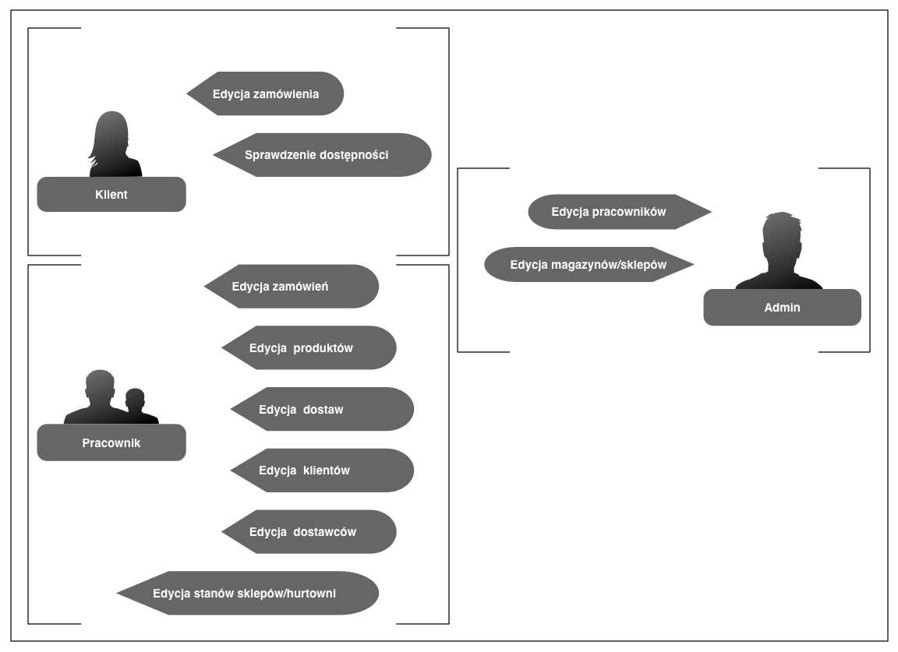
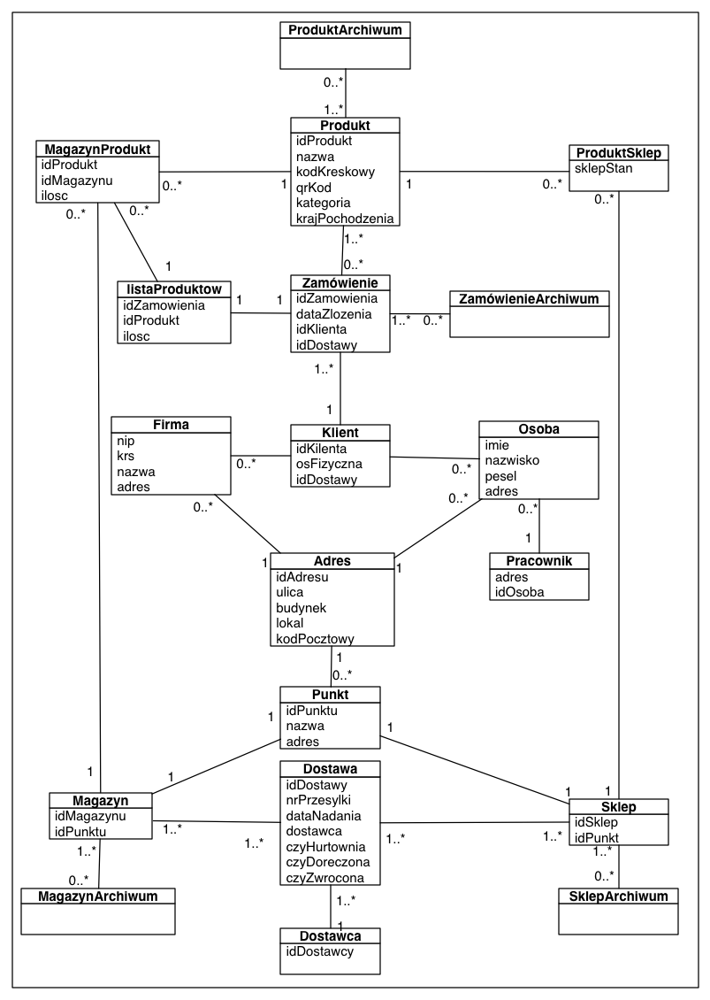
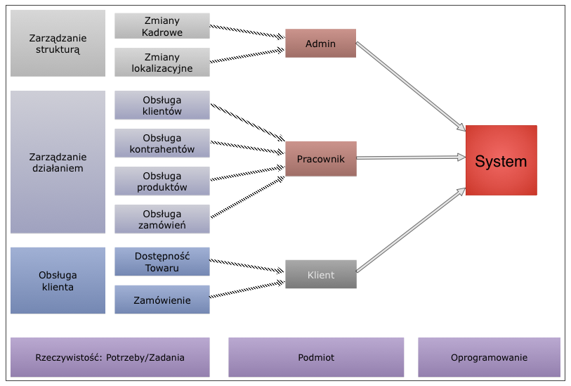

Aplikacje Bazodanowe semestr letni 1314
=======

## Projekt Funkcjonalny Aplikacji
### System zarządzania siecią dystrybucyjną

**Autorzy:  
Łukasz Szkup  
Milena Trząsała  
Stanisław Wołowski**

---------

### Analiza biznesowa
#### Jaki wycinek rzeczywistości oprogramowujemy?

Nasz projekt budujemy w oparciu o znajomość firmy która w 2009. roku była największym importerem fajek wodnych (również artykułów związanych z użytkowaniem) oraz posiadała największą sieć dystrybucyjną w Polsce, którą chcemy oprogramować.

Aplikacja ma obsługiwać sieć dystrybucyjną posiadającą zróżnicowane obiekty funkcjonalne: hurtownie, sklepy, lokale usługowe oraz możliwości nadzoru handlu internetowego.

Najważniejszym elementem w sprawnym funkcjonowaniu tak dużej sieci dystrybucyjnej jest przepływ informacji oraz kontrola stanów wyposażenia każdej lokalizacji.  

- Hurtownie/Magazyny jako elementy centralne sieci dystrybucyjnej muszą na bieżąco posiadać informacje o stanach własnych, sklepów oraz lokali usługowych.  
- Sklepy muszą mieć możliwość zamówienia większej ilości towaru na żądanie klienta, oraz sprawdzenia dostępności towaru w hurtowniach.  
- Lokale usługowe tj. Shisha-bar'y muszą na bieżąco być zaopatrywane w tytonie fajkowe, węgle, oraz części eksploatacyjne i naprawcze do fajek. Konieczny jest również mechanizm zaopatrzenia się w większe ilości towaru przed planowanym większym natężeniem ruchu (w logice bazy danych lokal usługowy reprezentowany jest jako jeden ze sklepów).  
- Obsługujący handel internetowy potrzebuje możliwości sprawdzenia dostępności towaru i możliwości dostarczenia zamówionego towaru do wybranego punktu sieci w celu odbioru osobistego.  

### Wymagania użytkownika
- Administrator
    - edycja zawartości bazy pracowników
    - edycja zawartości bazy punktów (magazyn/hurtownia/sklep/lokal usługowy)
- Pracownik
    - edycja zawartości bazy klientów
    - edycja zawartości bazy dostawców
    - edycja zawartości bazy produktów
    - edycja zawartości bazy zamówień (dostaw do osób klientów/punktów)
        - Zabezpieczenie dostępności towaru
- Klient
    - sprawdzanie dostępności
    - składanie zamówienia

### Diagram przypadków użycia
#### Jakie funkcjonalności ma program

### Diagram bazy danych

### Koncepcja architektury systemu

#### Jak aplikacja jest zbudowana, jakie ma warstwy, itd.

System zostanie wykonany w modelu MVC, przy użyciu narzędzia ORM. Rozwinięciem MVC jest  Model, View, Controller. Jest to architektura tworzenia aplikacji z podziałem na warstwy.
Poszczególne warstwy wydzielone są względem ich funkcjonalności.

- **Warstwa Model** jest warstwą odpowiedzialną za przechowywanie danych w formie obiektowej, warstwa ta jest mapowana dzięki rozwiązaniu ORM (Object-relational mapping) do relacyjnej bazy danych gdzie jest trwale przechowywana.
- **Warstwa View** jest warstwą odpowiedzialną za interfejs użytkownika generuje ona okna lub strony www pozwalające użytkownikowi na interakcje z aplikacją.
- **Warstwa Controller** jest warstwą odpowiedzialną za kontakt między obiema poprzednimi warstwami, głównie w niej zostanie zawarta logika biznesowa rozwiązania.

#### Scenariusze użycia

| Edycja zamówień | Edycja produktów
| :-- | :-- 
| **Warunki wstępne:** Pracownik zalogowany jest w systemie | **Warunki wstępne:** Pracownik jest zalogowany w systemie

